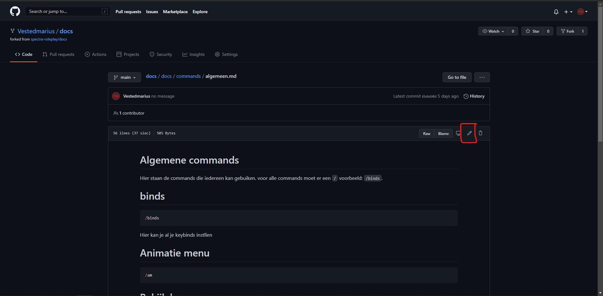
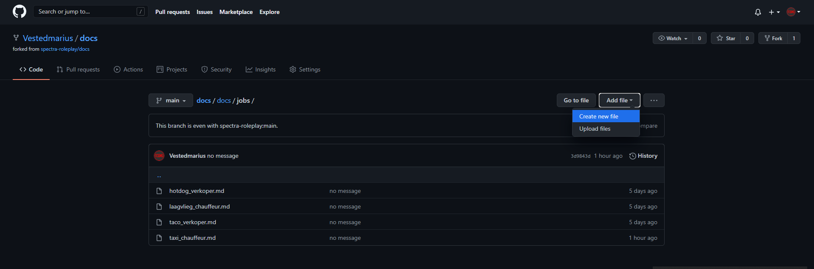
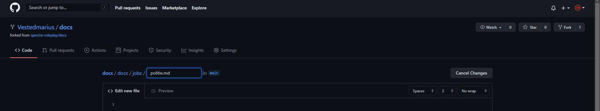
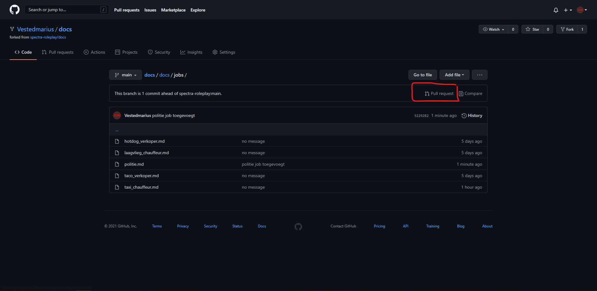
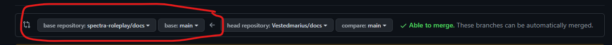

# Welkome op de Spectra docs

Hier kan je alle informatie vinden over **[SPECTRA ROLEPLAY](https://spectrarp.nl)**.

## Help de docs verbeteren!

Staan er dingen niet op de docs die jij wel kent? Help ons en voeg ze toe.

Hoe voeg je dingen toe.
1. Ga naar https://github.com/spectra-roleplay/docs
1. Fork de repo
   
   Je hebt nu een fork gemaakt deze staat nu tussen je repo lijst.
1. Druk op je profiel foto en klik op Your repositories.
   
   Je komt nu in een lijst met met al je repo's
1. Klick op de repo die docs heet.
   
   Je bent zit nu in jouw kopie van de repo.
1. Maak veranderingen of voeg dingen toe.
   De paginas zitten in de map `docs` hierin zie je meerdere mapjes en bestanden, ieder mapje is een subcatogorie en ieder `md` bestand is een pagina.
   ### Hoe pas je een pagina aan
   1. zoek de pagina
   1. klick op de pagina
   1. Klick nu op de aanpas knop
   
   Je kunt nu dingen in de pagina aanpassen.
   1. Maak een commit, zorg dat je een duidelijte titel geeft!
    
    ### Hoe voeg je paginas toe
   
   1. Ga naar de subcatogorie waar jij een pagina toe wil voegen
   1. Klick op `add file/create new file`
     
   1. Geef het bestand een naam, hier **moet** `.md` achter staan!
   
   1. zet nu in het bestand wat jij er in wil hebben.
   1. Maak een commit, zorg dat je een duidelijte titel geeft!
    
1. Klick op pullrequest
   
1. Zorg er voor dat het eerste deel het zelfde is als in de foto.
   
1. Klick op create pull request
   

Als je de bovenstaande stappen gedaan hebt dan zal staff het gaan bekijken en als je het goed vinden dan kom thet inde docs!